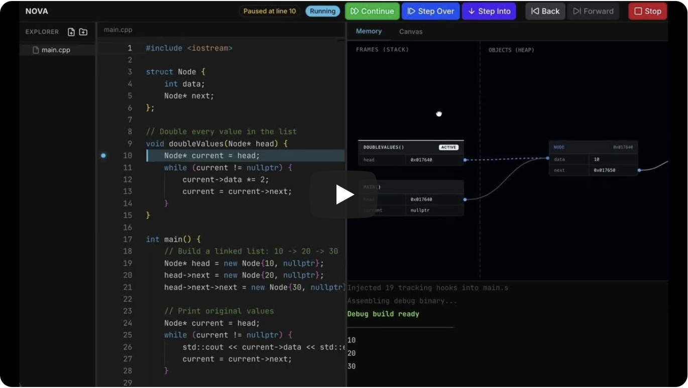
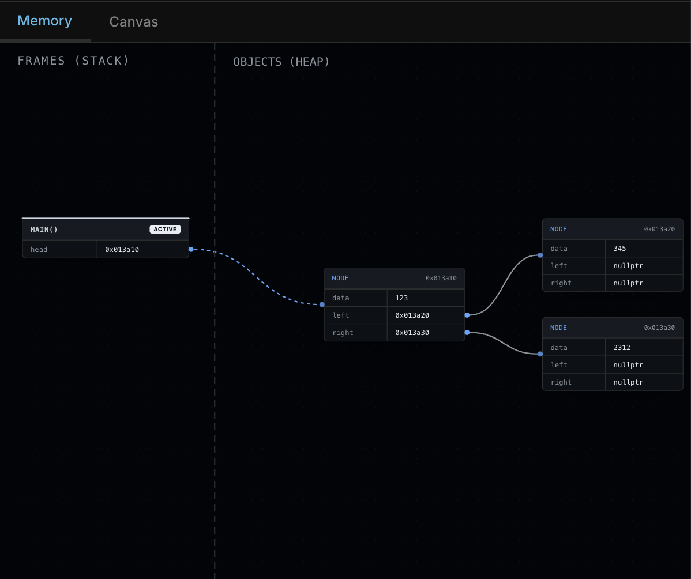
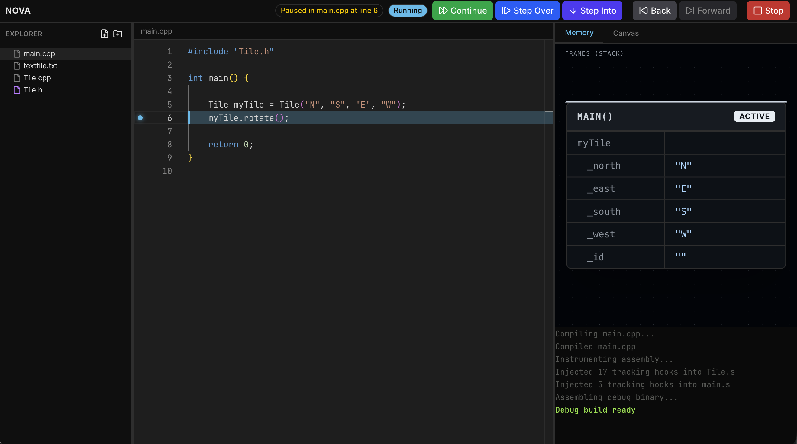
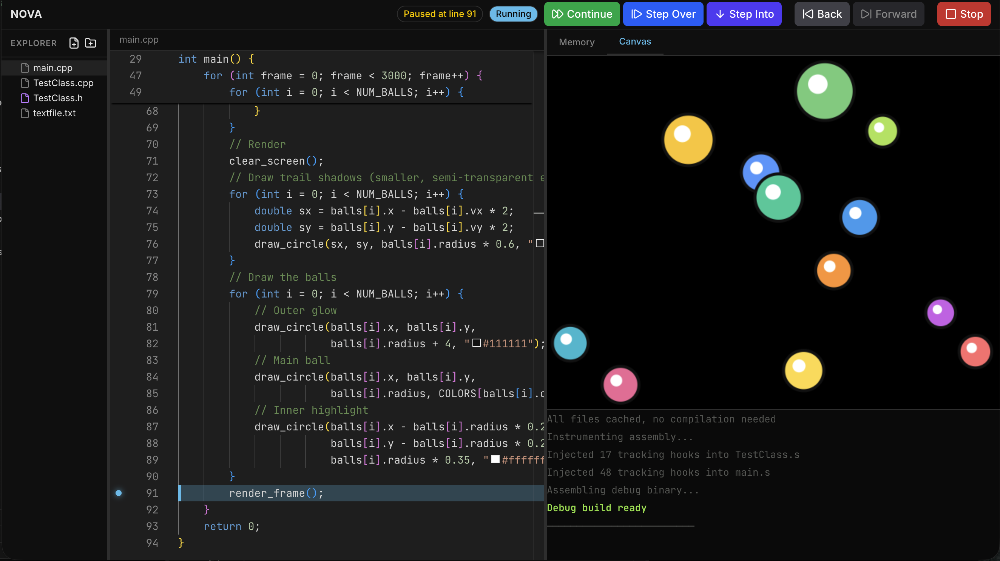

# Nova

A browser-based C++ IDE with in-browser compilation, step-through debugging, and live memory visualization — no installs required.

## Demo

<!-- Add a screen recording / GIF of the full workflow here -->
<!--  -->
- Video Demo
[](https://www.youtube.com/watch?v=HFhQspCLCtA)
- Live Demo [https://nova-ide.netlify.app](https://nova-ide.netlify.app)


## Features

- **Monaco code editor** with C++ syntax highlighting and autocomplete
- **In-browser compilation** via Clang compiled to WebAssembly (YoWasp)
- **Step-through debugger** with breakpoints, step-in/over/out, and full execution history
- **Live memory visualizer** - interactive graph of stack frames, heap allocations, and pointer relationships

- **Integrated terminal** for program I/O
- **Multiple Files + Classes** - virtual filesystem is auto-saved locally and files can be included in programs like normal.

- **Canvas output** for graphics programs


## TODO

- [ ] Connect terminal to STDIN
- [ ] Add intellisense
- [ ] Flesh out the graphics library

## Architecture

```
Source code → Clang (WASM) → Assembly → Instrumentation → WASM binary
                                                            ↓
                                          SharedArrayBuffer debugger
                                                            ↓
                                           DWARF line maps + variable info
                                                            ↓
                                              Memory snapshots → Visualizer
```

## Getting Started

```bash
npm install
npm run dev
```

Open [http://localhost:5173](http://localhost:5173).

## Tech Stack

| Layer | Technology |
|-------|------------|
| UI | React, Tailwind CSS, Radix UI |
| Editor | Monaco Editor |
| Compiler | YoWasp Clang (WebAssembly) |
| Debugger | Custom ASM instrumentation + SharedArrayBuffer |
| Visualizer | React Flow (xyflow) + dagre layout |
| State | Zustand |
| Terminal | xterm.js |

