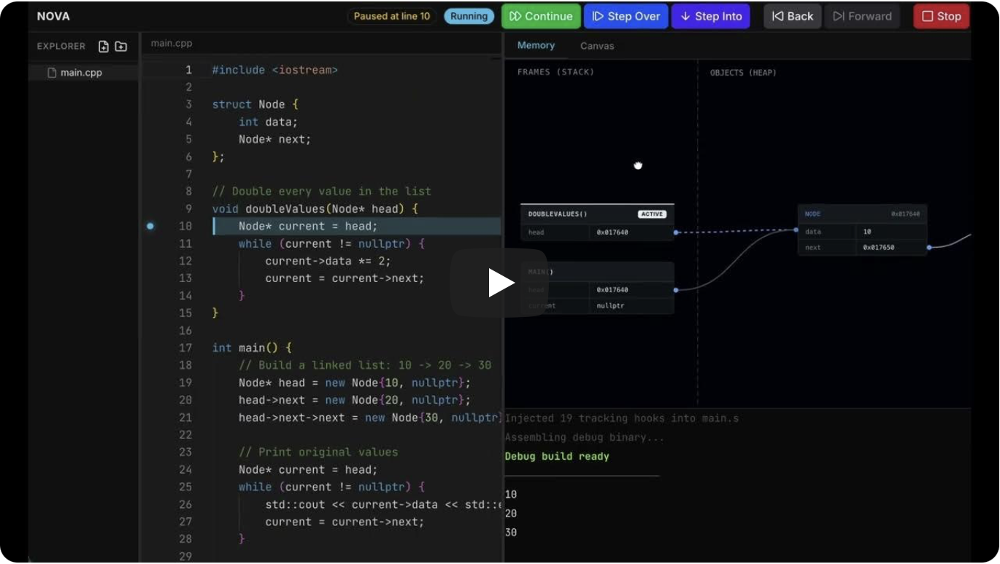
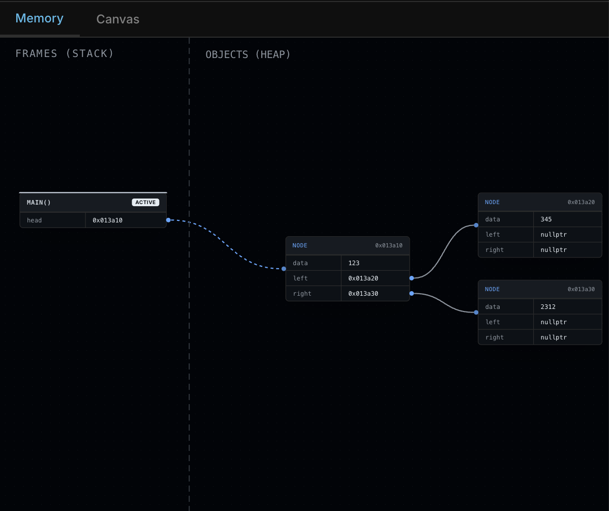
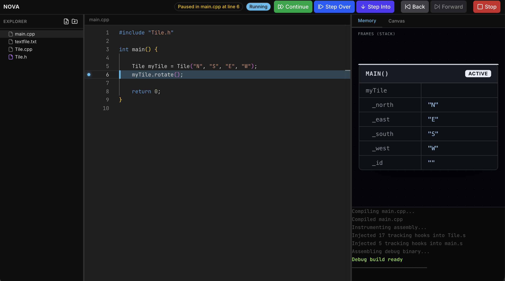
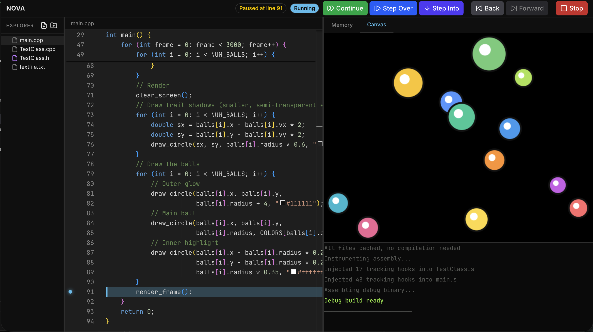

# Nova

A browser-based C++ IDE with in-browser compilation, step-through debugging, and live memory visualization — no installs required.

## Demo

<!-- Add a screen recording / GIF of the full workflow here -->
<!--  -->
- Video Demo
[](https://www.youtube.com/watch?v=HFhQspCLCtA)
- Live Demo [https://nova-ide.netlify.app](https://nova-ide.netlify.app)


## Features

- **Monaco code editor** with C++ syntax highlighting and autocomplete
- **In-browser compilation** via Clang compiled to WebAssembly (YoWasp)
- **Step-through debugger** with breakpoints, step-in/over/out, and full execution history
- **Live memory visualizer** - interactive graph of stack frames, heap allocations, and pointer relationships

- **Integrated terminal** for program I/O, including line-buffered stdin (`cin`, `scanf`, ^C/^D handling)
- **Intellisense** - full clangd LSP (completion, hover, diagnostics, go-to-definition) running in a worker
- **Student testing framework** - `STUDENT_TEST("name") { EXPECT_EQUALS(...); }` blocks with a results panel, modeled on Stanford's SimpleTest
- **Multiple Files + Classes** - virtual filesystem is auto-saved locally and files can be included in programs like normal.

- **Canvas output** for graphics programs


## TODO

- [ ] Flesh out the graphics library

## Architecture

```
Source code → Clang (WASM) → Assembly → Instrumentation → WASM binary
                                                            ↓
                                          SharedArrayBuffer debugger
                                                            ↓
                                           DWARF line maps + variable info
                                                            ↓
                                              Memory snapshots → Visualizer
```

## Getting Started

```bash
npm install
npm run dev
```

Open [http://localhost:5173](http://localhost:5173).

The IDE is available at `/ide` standalone, with **no sign-in required**. To use the built-in LMS (teacher dashboards, student assignments, submission auto-save, research analytics), follow the self-hosting setup below.

## Self-hosting setup (built-in LMS)

Nova ships with a small in-repo LMS so a teacher can create assignments with starter files, students can open them in the IDE, and their work auto-saves to a database. All of this runs on free-tier **Firebase** — you don't need a server.

You only need to do this once per deployment.

### 1. Create a Firebase project

1. Go to <https://console.firebase.google.com> and click **Add project**.
2. Give it any name (e.g. `nova-lms`). You can skip Google Analytics.
3. Once the project is created, you'll land on its dashboard.

### 2. Enable Google sign-in

1. In the left sidebar, click **Build → Authentication → Get started**.
2. Open the **Sign-in method** tab.
3. Click **Google**, toggle it on, set a support email, and **Save**.
4. (Optional — recommended) Under **Settings → Authorized domains**, add the domain you'll deploy to (e.g. `your-app.netlify.app`). `localhost` is already there for local testing.

### 3. Create a Firestore database

1. In the left sidebar, click **Build → Firestore Database → Create database**.
2. Choose **Start in production mode** (you'll paste rules in step 5).
3. Pick a location close to your users (e.g. `nam5` for North America). This can't be changed later.

### 4. Register a web app and copy its config

1. On the project dashboard, click the **`</>` (Web)** icon next to "Get started by adding your first app".
2. Give it a nickname (e.g. `nova-web`). You **don't** need Firebase Hosting.
3. Firebase will show you a `firebaseConfig` block. Copy the six string values.
4. In this repo, copy `.env.example` to `.env.local`:
   ```bash
   cp .env.example .env.local
   ```
5. Paste the values into `.env.local`. The mapping is:

   | Firebase console field | `.env.local` key |
   |---|---|
   | `apiKey` | `VITE_FIREBASE_API_KEY` |
   | `authDomain` | `VITE_FIREBASE_AUTH_DOMAIN` |
   | `projectId` | `VITE_FIREBASE_PROJECT_ID` |
   | `storageBucket` | `VITE_FIREBASE_STORAGE_BUCKET` |
   | `messagingSenderId` | `VITE_FIREBASE_MESSAGING_SENDER_ID` |
   | `appId` | `VITE_FIREBASE_APP_ID` |

### 5. Install the security rules

The repo includes a `firestore.rules` file enforcing: students can only read/write their own submission docs, teachers can only edit their own assignments, the `events` analytics collection is append-only, etc. You **must** install these — without them anyone could read everyone's data.

Two options:

**Option A — Paste into the console (easiest, no extra tools):**

1. Open **Firestore Database → Rules** in the Firebase console.
2. Open `firestore.rules` in this repo and copy its entire contents.
3. Paste, overwriting whatever is there.
4. Click **Publish**.

**Option B — Firebase CLI (recommended if you'll iterate on rules):**

```bash
npm install -g firebase-tools
firebase login
firebase use --add   # pick the project you created
firebase deploy --only firestore:rules
```

### 6. Run it

```bash
npm install
npm run dev
```

Visit <http://localhost:5173>. You should see the sign-in page. Sign in with Google, pick "Teacher" the first time, and you're in.

### 7. Deploy (optional)

Any static host works — the repo includes a `netlify.toml` for Netlify with the SPA redirect and the COOP/COEP headers Nova needs for its in-browser debugger. Push to a Git host and connect it to Netlify (or your platform of choice). Remember to set the same `VITE_FIREBASE_*` environment variables in the host's dashboard.

### Notes for instructors

- **Roles are permanent** from the user's side. If a student picks "Teacher" by mistake, edit their `role` field directly in the Firestore console.
- **Submission size**: a single assignment + submission is limited to ~1 MB by Firestore. Plenty for typical CS-class assignments; unsuitable for large media.
- **Analytics**: every compile / run / edit / step is logged to the `events` collection with the student's UID, the assignment ID, and a session ID. Export to BigQuery via the Firebase Extensions marketplace if you want to analyze it offline.

## Two engine flavors

Nova has two debug engines in active development. Both ship the same LMS, the same UI, and the same student experience — only the underlying compile/debug stack differs. Pick one when you check out the repo:

| Branch | Engine | What it uses |
|---|---|---|
| `feat/lms-firebase-analytics` (tag `lms-legacy-stable`) | **Legacy** | In-house ASM instrumentation + SharedArrayBuffer stepping. Stable, ships the Stanford library, currently in production at [nova-ide.netlify.app](https://nova-ide.netlify.app). |
| `feat/lms-on-dap` | **DAP** | New `NpmDapEngine` adapter against the standard Debug Adapter Protocol. Cleaner architecture, swappable backends, ongoing work. |

To switch:

```bash
git checkout feat/lms-firebase-analytics    # legacy + LMS
# …or…
git checkout feat/lms-on-dap                # DAP + LMS

npm install      # branch-specific deps (Firebase + router are present in both)
npm run dev
```

The LMS layer (everything in [src/lms/](src/lms/), [src/shared/](src/shared/), [public/auth.html](public/auth.html), [firestore.rules](firestore.rules)) is **identical on both branches** — it consumes the IDE via the host-context interface defined in [src/ide-host.ts](src/ide-host.ts) and never touches engine internals. That's why the same backend, the same assignments, and the same student submissions work against either engine.

If you're new and just want it working, use the **legacy** branch. The DAP branch is the future direction once it reaches feature parity.

## Stanford library integration (design note)

The Stanford library (CS106-style headers under [stanford-lib/](stanford-lib/)) currently lives on the legacy branch as a sysroot extension — its headers are written into `/sysroot/include/` at boot so student code can `#include "console.h"` etc.

For the LMS, each assignment will declare which libraries it depends on. Sketch:

```ts
// shared/types.ts (planned)
type Assignment = {
  // …existing fields…
  libraries?: ('stdlib' | 'stanford' | 'graphics')[]
}
```

On assignment open, the IDE bootstraps `/sysroot/` from a manifest of registered library bundles based on `assignment.libraries`. Each bundle is a `Record<path, content>` shipped as a JSON or zipped asset under [public/sysroot/](public/sysroot/) (or fetched from a CDN). The IDE host-context already supports arbitrary `initialFiles` — the same mechanism extends naturally to sysroot files by namespacing on `/sysroot/` instead of `/workspace/`.

Concretely on the DAP branch where `/sysroot/` was removed: re-introduce a `bootstrapSysroot(files)` helper alongside [bootstrapWorkspace](src/vfs/volume.ts) and have the engine adapter consume sysroot files at compile time. That's the right v2 step.

## Tech Stack

| Layer | Technology |
|-------|------------|
| UI | React, Tailwind CSS, Radix UI |
| Editor | Monaco Editor |
| Compiler | YoWasp Clang (WebAssembly) |
| Debugger | Custom ASM instrumentation + SharedArrayBuffer |
| Visualizer | React Flow (xyflow) + dagre layout |
| State | Zustand |
| Terminal | xterm.js |

